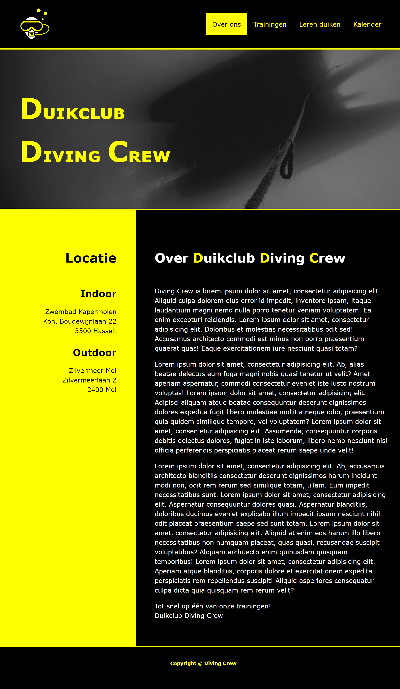
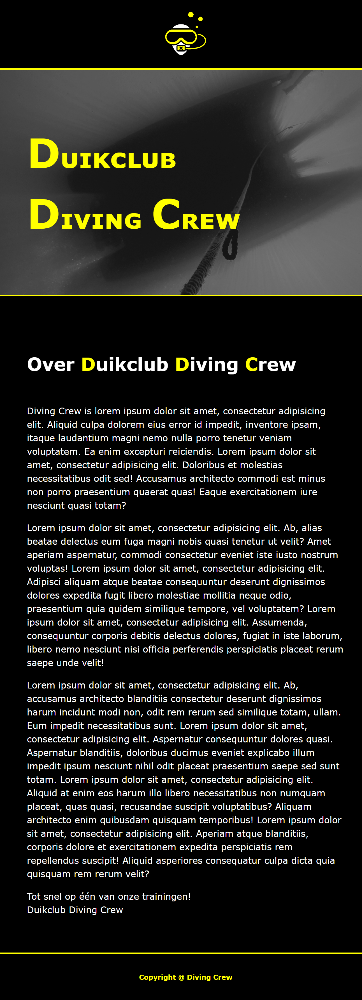

# Proefexamen 
Met Bootstrap Grid

## Opdracht 1 (56 punten)

Open de bestanden ‘opdr1.html’ en ‘opdr1.css’ in Webstorm. Volg onderstaande stappen en bekijk aandachtig de screenshots om te komen tot het nodige eindresultaat. 

Voor deze opdracht mag je geen tabellen gebruiken, indien je dit toch doet, worden de punten van deze opdracht gehalveerd!
.

#### Stap 1 – Meta-gegevens en linken
- De webpagina bevat alle nodige meta-gegevens en linken. 

#### Stap 2 – CSS Reboot en algemene opmaak
- De HTML-elementen hebben standaard geen witruimte binnen of buiten het element.
- De volledige webpagina bevat de lettertypes ‘Verdana’, ‘Arial’ en ‘sansserif’ en alle teksten hebben een lijnhoogte van 1,5.
- De randen en de witruimtes binnen de elementen worden meegerekend in de eventuele ingestelde breedtes van de HTML-elementen.
- De achtergrond van de webpagina is #000. 

#### Stap 3 – De navigatiebalk 
Voorzie een navigatiebalk met een logo en vier knoppen.
- Het logo en de vier knoppen in de navigatiebalk staan gepositioneerd via CSS3 Flexbox.
- De navigatiebalk is 82,5rem breed en staat horizontaal in het midden van de webpagina. De navigatiebalk heeft rondom 1rem witruimte binnen het element.
- Het logo staat links in de navigatiebalk, is 5rem breed en heeft boven en onder 1rem witruimte buiten het element.
- De vier knoppen staan in een ongeordende lijst. De eerste drie knoppen (Over ons, Trainingen en Leren duiken) bevatten linken naar de drie opdrachten van dit examen. De vierde knop (Kalender) bevat een dummy-link. De linken naar opdracht twee (Trainingen) en opdracht drie (Leren Duiken) moeten, wanneer de bezoekers van de webpagina hierop klikken, openen in een nieuw tabblad. De link naar opdracht 1 (Over ons) en de dummy-link moeten openen in hetzelfde tabblad.
- De vier knoppen staan rechts op de navigatiebalk, hebben rondom 1rem witruimte binnen het element en boven en onder 0.5rem witruimte buiten het element. De vier knoppen staan daarnaast ook verticaal gecentreerd in de navigatiebalk.
- De tekstkleur van de knoppen is #FF0 en er zit geen lijntje onder de tekst van de knoppen. 
- Wanneer een knop actief is of wanneer de bezoeker met de muis over een knop gaat, moet de tekstkleur #000 worden en de achtergrondkleur #FF0.  

#### Stap 4 – De header 
Voorzie, onder de navigatiebalk, een header.  
- De header bevat een container die 82,5rem breed is en 25rem hoog is. De container staat horizontaal in het midden van de webpagina. 
- De tekst in de container staat gepositioneerd via CSS3 Flexbox.  
- De tekst in de header heeft een horizontale uitlijning ‘links’ en een verticale uitlijning ‘center’. 
- De tekst strekt zich uit over twee regels en staat in small-caps. De tekstkleur is #FF0 en de lettergrootte is 3rem, met uitzondering van iedere eerste letter van elk woord. Deze eerste letters hebben een lettergrootte van 4.5rem. 
- De afbeelding in de header is een achtergrondafbeelding genaamd ‘header.png’. De achtergrondafbeelding bedekt altijd de volledige header. De focus van de achtergrondafbeelding ligt op de rechterbenedenhoek. 
- De header heeft boven en onder een volle rand van 3px in de kleur #FF0. 

#### Stap 5 – De main 
Voorzie, onder de header, een main met twee secties.    
- De volledige main heeft een positionering én de aanduiding van de witruimtes binnen en buiten de elementen via Bootstrap-classes.
- In de main staan twee kolommen in een rij en container. Deze twee kolommen nemen samen de volledige breedte van de webpagina in vanaf een schermbreedte < 1200px. Is de schermbreedte ≥ 1200px, dan heeft de container een vaste breedte met links en rechts witruimte. 
- De kolommen hebben meerdere breekpunten om de breedtes van de kolommen te voorzien op basis van de schermbreedte. 
	- Bij een schermbreedte ≥ 1200px is de linkse kolom 3 breed en de rechts kolom 9 breed. 
	- Bij een schermbreedte ≥ 992px en < 1200px is de linkse kolom 4 breed en de rechts kolom 8 breed. 
	- Bij een schermbreedte ≥768px en < 992px is de linkse kolom 5 breed en de rechts kolom 7 breed. 
	- Bij een schermbreedte < 768px komen de kolommen onder elkaar te staan en nemen ze de volledige breedte van de container in.   
- De twee kolommen hebben rondom 3rem witruimte binnen het element. 
- De titels van niveau 1 hebben boven en onder 3rem witruimte binnen het element.  
- De titels van niveau 2 hebben onder 1rem witruimte binnen het element.  
- De paragrafen in de linkse kolom hebben onder 1,5rem witruimte binnen het element en de paragrafen in de rechtse kolom hebben onder 1rem witruimte binnen het element. 
- De linkse kolom heeft als achtergrondkleur #FF0 en als tekstkleur #000. De tekst in de linkse kolom heeft tekstuitlijning ‘rechts’. 
- De rechtse kolom heeft tekstkleur #FFF, op drie letters in de titel van niveau 1 na. Deze drie letters hebben tekstkleur #FF0. 

#### Stap 6 – De footer 
Voorzie, onder de main, een footer. 
- De footer heeft rondom een witruimte binnen het element van 2rem. 
- De footer heeft boven een volle rand van 3px dikte in de kleur #FFO. 
- De tekst in de footer bevat een mailto-koppeling naar het e-mailadres ‘info@duikclub-dc.be’ op de woorden ‘Diving Crew’. 
- De volledige tekst in de footer heeft tekstuitlijning ‘gecentreerd’ en de tekstkleur #FF0. De tekst heeft een letterdikte ‘700’ en een lettergrootte van 0,75rem. Onder de tekst staat geen lijntje.  
- Wanneer de bezoeker met de muis over de woorden ‘Diving Crew’ gaat, komt er een lijntje onder de twee woorden te staan. 

#### Stap 7 – Responsiviteit 
Voorzie de nodige ‘extra’ opmaak zodat de webpagina zich correct aanpast aan de breedte van het scherm. 
- Wanneer het scherm een breedte heeft < 85rem: 
	- Moeten de navigatiebalk en de header de volledige breedte van het scherm innemen.  
	- Moeten de navigatiebalk en de header boven en onder 0 witruimte binnen het element en links en rechts 3rem witruimte binnen het element krijgen.    
- Wanneer het scherm een breedte heeft < 48rem: 
	- Moet de linkse kolom in de main onzichtbaar worden en geen plaats meer innemen op de webpagina. 
	- Moeten de vier knoppen in de navigatiebalk onzichtbaar worden en geen plaats meer innemen op de webpagina. 
	- Moet het logo in de navigatiebalk een horizontale uitlijning ‘center’ krijgen. 
	

## Opdracht 2 (22 punten)

Open de bestanden ‘opdr2.html’ en ‘opdr2.css’ in Webstorm. Volg onderstaande stappen en bekijk aandachtig de screenshots om te komen tot het nodige eindresultaat. 

Voor deze opdracht mag je geen classes of id’s gebruiken, indien je dit toch doet, worden de punten van deze opdracht gehalveerd!
.

#### Stap 1 – Meta-gegevens en linken 
- De webpagina bevat alle nodige meta-gegevens en linken.   

#### Stap 2 – CSS Reboot en algemene opmaak 
- De HTML-elementen hebben standaard geen witruimte binnen of buiten het element. 
- De volledige webpagina bevat de lettertypes ‘Verdana’, ‘Arial’ en ‘sans-serif’. 
- De randen en de witruimtes binnen de elementen worden meegerekend in de eventuele ingestelde breedtes van de HTML-elementen. 
- De achtergrond van de webpagina is #000.

#### Stap 3 – De tabel 
Voorzie in de main een tabel met een thead, tbody en tfoot. 
- De eerste twee rijen staan in de thead, de volgende zeven rijen in de tbody en de laatste rij in de tfoot. 
- Sommige cellen zijn horizontaal of verticaal samengevoegd. 
- Maak, waar nodig, gebruik van th’s en td’s om de cellen in de tabel te voorzien.   

#### Stap 4 – De opmaak van de tabel 
- De tabel heeft boven 2rem witruimte buiten het element. 
- De volledige tabel is 70rem breed. 
- Alle kolommen in de tabel zijn exact even breed. 
- De buitenste rand van de tabel is een volle rand van 3px in de kleur #FFF. 
- De randen rond de cellen zijn volle randen van 1px in de kleur #FFF. Tussen de cellen zit geen spatie of witruimte. 
- Alle cellen hebben rondom 1rem witruimte binnen het element, enkel de eerste cel in de thead heeft rondom 2rem witruimte binnen het element. 
- De tekst in de cel in de eerste rij van de thead heeft lettergrootte 2rem, staat in small-caps en heeft de tekstkleur #FF0. Onder de tekst staat een lijntje.  
- De teksten in de cellen in de tweede rij van de thead hebben tekstuitlijning ‘links’ en tekstkleur #FFF. De woorden de tussen haakjes staan schuingedrukt en hebben lettergrootte 0,5rem. 
- De eerste drie rijen van de tbody hebben tekstkleur #FF9B9B en achtergrondkleur #100000. De vierde, vijfde en zesde rij van de tbody hebben tekstkleur #EBFF9E en achtergrondkleur #031000. De laatste rij in de tbody heeft tekstkleur #9BD1FF en achtergrondkleur #000510. 
- De tekst in de tfoot heeft tekstuitlijning ‘center’, lettergrootte 0,75rem, tekstkleur #FFF en staat schuingedrukt.

## Opdracht 3 (22 punten) 
Open de bestanden ‘opdr3.html’ en ‘opdr3.css’ in Webstorm. Volg onderstaande stappen en bekijk aandachtig de screenshots om te komen tot het nodige eindresultaat. 

Voor deze opdracht mag je geen tabellen gebruiken, indien je dit toch doet, worden de punten van deze opdracht gehalveerd!

**In deze opdracht mag je zelf de manier van positioneren (CSS3 Flexbox) kiezen.**

#### Stap 1 – Meta-gegevens en linken 
- De webpagina bevat alle nodige meta-gegevens en linken.  

#### Stap 2 – CSS Reboot en algemene opmaak 
- De HTML-elementen hebben standaard geen witruimte binnen of buiten het element.    
- De volledige webpagina bevat de lettertypes ‘Verdana’, ‘Arial’ en ‘sans-serif’. 
- De randen en de witruimtes binnen de elementen worden meegerekend in de eventuele ingestelde breedtes van de HTML-elementen. 
- De achtergrond van de webpagina is #000.  

#### Stap 3 – Het contactformulier 
Voorzie een contactformulier met verschillende type invoervelden, labels en knoppen. 
- De labels en de invoervelden zijn, waar mogelijk, aan elkaar gelinkt. 
- De invoervelden met een sterretje zijn verplicht in te vullen. 
- Het invoerveld voor de datum bevat extra validatie. Er kan enkel een datum vanaf 1 februari 2023 op woensdag (om de 7 dagen) worden ingegeven. 
- Het invoerveld voor het uur heeft als standaardwaarde ‘18:00’. 
- De radiobuttons vormen één geheel en bevatten volgende waarden: 
	- Apnueduiken 
	- Snorkelen 
	- Duiken (standaard geselecteerd) 
- De invoervelden ‘Volledige naam’, ‘E-mailadres’ en ‘Extra informatie’ bevatten tijdelijke teksten die de bezoekers moeten helpen bij het invullen. 
- Bij het klikken op de knop ‘Proefles aanvragen’ opent de standaard mailcliënt op de computer. De mail met de ingevulde gegevens wordt opgemaakt voor ontvanger ‘info@duikclub-dc.be’ en heeft als onderwerp ‘Contactformulier’. Alle ingevulde gegevens staan in de mail onder elkaar als platte tekst.
  

#### Stap 4 – De opmaak van het contactformulier 
- Het formulier staat in de main van de webpagina, is 50rem breed en heeft boven en onder 2rem witruimte buiten het element. 
- Het merendeel van de labels zijn 15rem breed. Deze labels hebben boven en onder 1rem witruimte buiten het element. Daarnaast hebben deze labels boven en onder ook 0,5rem witruimte binnen het element. 
- De labels van de radiobuttons wijken wat af en zijn 10rem breed. Deze labels hebben boven en onder 1rem witruimte buiten het element. Daarnaast hebben deze labels boven en onder 1rem en links en rechts 0.5rem witruimte binnen het element. 
- De eerste vier invoervelden van het formulier zijn 35rem breed. Deze invoervelden hebben geen outline en hebben enkel een volle onderrand van 2px in de kleur #FF0. De invoervelden hebben boven en onder 1,5rem witruimte buiten het element en rondom 0,5rem witruimte binnen het element. 
- De radiobuttons staan langs elkaar en zijn 1rem breed. De radiobuttons hebben boven en onder 1,5rem witruimte buiten het element en rondom 0,5rem witruimte binnen het element. 
- Het tekstveld van meerdere regels is 7rem hoog en 35rem breed. Het tekstveld van meerdere regels heeft geen outline en enkel een volle onderrand van 2px in de kleur #FF0. De witruimte binnen het tekstveld van meerdere regels is rondom 0,5rem. Het tekstveld van meerdere regels heeft ook boven en onder 1,5rem witruimte buiten het element. 
- De knop onderaan het formulier is 50rem breed, heeft een volle rand van 2px in de kleur #FF0 en rondom 1rem witruimte binnen het element. De tekst van de knop heeft lettergrootte 1rem. 